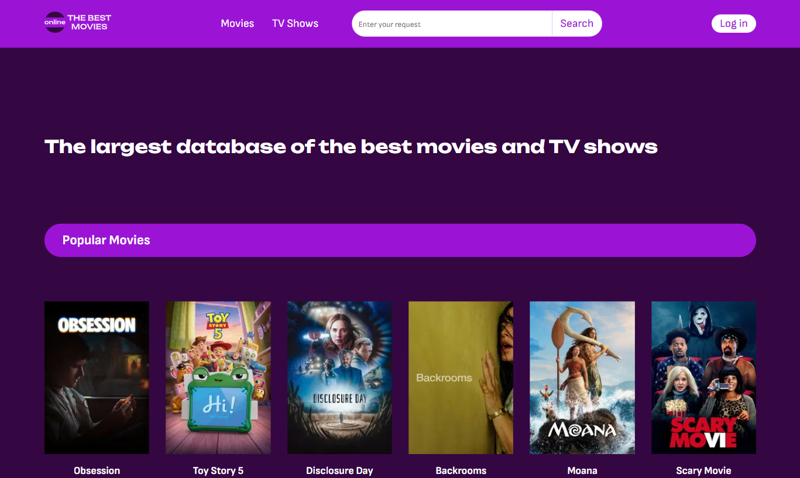

# The Movies App

Final project from the React/Next.js training course. A movie discovery app built with Next.js and The Movies Database API.

🔗 **[Live Demo](https://react-next-exam.vercel.app/)**

## Features

- Browse movies list with pagination
- Sort movies by genre
- Search for movies
- View detailed information on a separate movie page
- Client-side routing

## Tech Stack

- Next.js 15 (App Router)
- React 19
- TypeScript
- [The Movies Database API](https://developers.themoviedb.org/3)

## Getting Started

Clone the repository and install dependencies:

\`bash
git clone https://github.com/Anna-Kashyra/react-next-exam.git
cd react-next-exam
npm install
\`

Run the development server:

\`bash
npm run dev
\`

Open [http://localhost:3000](http://localhost:3000) to see the result.
